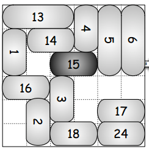

# Chapter 18 - Planning solves the Rush Hour problem

## Introduction

Rather than going through the algorithm first, it might be
better to look at the game first and see what functions are needed
to enable the game play.

[Rush Hour](http://www.amazon.com/Think-Fun-5000-ThinkFun-Rush/dp/B00000DMER) is a
sliding block puzzle played on a 6x6 grid.

Here's an example starting position from 
an [online version](http://www.agame.com/game/rush_hour_2):


The objective is to get the 2-block car on row 3 to the exit.

We define the following basic types to describe the 
game state:

```haskell
type Cell = Int
type Grid = [(Cell, Cell)] 
```

The cell is an integer value taken from the following grid:

```haskell
01 02 03 04 05 06
08 09 10 11 12 13
15 16 17 18 19 20
22 23 24 25 26 27
29 30 31 32 33 34
36 37 38 39 40 41
```

The grid itself is a list of tuples of starting and ending points
for a vehicle. The grid in the book can be described as:

```haskell
g1 :: Grid
g1 = [  (17, 18), -- Special vehicle - i.e. our car.
        (1, 15), 
        (2, 9), 
        (3, 10), 
        (4, 11), 
        (5, 6), 
        (12, 19), 
        (13, 27), 
        (24, 26), 
        (31, 38), 
        (33, 34), 
        (36, 37), 
        (40, 41)]
```

The one in the image above is:

```haskell
g2 :: Grid
g2 = [  (16, 17), -- Special vehicle - i.e. our car.
        (1, 2),
        (8, 22),
        (29, 36),
        (11, 25),
        (38, 40),
        (33, 34),
        (6, 20)]
```

## Displaying the Grid

While this grid representation is more space-efficient than using regular 
cartesian coordinates, it does make it a bit tricker to display. We want 
something like this:

```haskell
ghci> drawGrid g1
 a b c d e e
 a b c d f g
 a . @ @ f g 
 . . h h h g
 . . i . j j
 k k i . l l

ghci> drawGrid g2
 a a . . . g
 b . . d . g
 b @ @ d . g 
 b . . d . .
 c . . . f f
 c . e e e .
```

> Note that I'm using characters instead of numbers as the book does.

We can represent this as a string of 36 characters, with "." for an empty
cell, "@" for the special vehicle, and "a" to "z" for the other vehicles.

> Note: in all of this we're relying on the fact that the vehicles in the
> grid array don't change position - the special vehicle is always the first
in the list. A move only changes the cell positions of the vehicle.

Our approach is to populate a grid map for each individual vehicle and
then superimpose all of them to produce a final grid map that can be
displayed.

Firstly, let's define the string representation of a completely blank grid:

```haskell
blankGrid :: String
blankGrid = replicate 36 '.'
```

This is just 36 dots representing 36 empty cells.

```haskell
ghci> blankGrid
"...................................."
```

Next we need to go from the positions in the grid to index positions 
within the string:

```haskell
cellToArrayPos :: Cell -> Int
cellToArrayPos c = (c `div` 7) * 6 + (c `mod` 7) - 1
```

For a horizontal vehicle, the mapping from the cells to array indices is simple:

```haskell
map cellToArrayPos  [a .. b]
```

For vertical vehicles, it's a bit more detailed:

```haskell
verticalPositions :: (Cell, Cell) -> [Int]
verticalPositions (a, b) 
    | b - a > 12    = [a, a + 7, b]
    | b - a == 7    = [a, b]
    | otherwise     = []
```

So we have the following function to convert from the cell positions

```haskell
vehiclePositions :: Grid -> [[Cell]]
vehiclePositions  = map vehiclePos
  where
    vehiclePos (a, b) 
        | isHorizontal (a, b)   = map cellToArrayPos  [a .. b]
        | otherwise             = map cellToArrayPos $ verticalPositions (a, b)
```

A vehicle is horizontal if the difference between the end cell and start cell
is less than 6. (Remember, the vehicles are either 2 or 3 cell lengths long). If
the difference is greater than 6, it's vertical:

```haskell
isHorizontal :: (Cell, Cell) -> Bool
isHorizontal (c1, c2) = c2 - c1 < 6 

isVertical :: (Cell, Cell) -> Bool
isVertical (c1, c2) = c2 - c1 > 6 
```

We can put the vehicle names in a list of characters:

```haskell
vehicleNames :: String
vehicleNames = "@" ++ ['a'..] -- The first vehicle is our special one - we mark it with an @.
```

> Note: the book uses vehicle numbers, with the special vehicle being number 0.
> Personally I find it easier to look at the letters.

Displaying a single vehicle in a map is as follows:

```haskell
showVehicle :: (Char, [Int]) -> String
showVehicle (c, xs) = gridPoints xs 0
  where
    gridPoints [] n   = replicate (36 - n) '.'
    gridPoints (x:xs) n = replicate (x - n) '.' ++ [c] ++ gridPoints xs (x + 1)
```

This gives us a string with a single vehicle represented on the grid. We can 
combine two of these to give us a superimposed view:

```haskell
superimpose :: String -> String -> String
superimpose = zipWith combine
  where
    combine :: Char -> Char -> Char
    combine topCh bottomCh
        | topCh == '.' && bottomCh == '.'   = '.'
        | topCh == '.' && bottomCh /= '.'   = bottomCh
        | topCh /= '.' && bottomCh == '.'   = topCh
        | topCh /= '.' && bottomCh /= '.'   = 'X'
```

Finally, we can show a grid to give us the final string representation for the
grid:

```haskell
showGrid :: Grid -> String
showGrid g = foldl superimpose blankGrid vehicleGrids
  where
    vehicles = zip vehicleNames (vehiclePositions g)
    vehicleGrids = map showVehicle vehicles
```

Displaying this string in a in a 6x6 grid is as follows:

```haskell
drawGrid :: Grid -> IO ()
drawGrid g = putStr $ intersperse ' ' $ "\n" ++ unlines (chunksOf 6 $ showGrid g)
```

Code in chap18a.hs

## Moving Vehicles

Let's start moving vehicles around.

We'll need more types:

```haskell
type Vehicle = Char
type Move = (Vehicle, Cell) 
type State = Grid
type Path = ([Move], State) 
type Frontier = [Path]
```

> Note: I've changed the Vehicle type to be a Char instead of an Int.
> I find it easier to look at the grid with characters.

The function `occupied` lets us know which cells are filled:

```haskell
occupied :: Grid -> [Cell]
occupied = foldr (merge . fillcells) []

fillcells :: (Enum a, Num a, Ord a) => (a, a) -> [a]
fillcells (r, f) = if r > f - 7 then [r .. f] else [r, r + 7 .. f]
```

```haskell
ghci> occupied g1
[1,2,3,4,5,6,8,9,10,11,12,13,15,17,18,19,20,24,25,26,27,31,33,34,36,37,38,40,41]
ghci> occupied g2
[1,2,6,8,11,13,15,16,17,18,20,22,25,29,33,34,36,38,39,40]
```

The function `freecells` gives us the opposite: the list of blank cells, while
`allcells` gives us the cell positions for every cell in the grid:

```haskell
freecells :: Grid -> [Cell] 
freecells g = allcells \\ occupied g

allcells :: [Cell]
allcells = [c | c <- [1 .. 41], c `mod` 7 /= 0]
```

```haskell
ghci> freecells g1
[16,22,23,29,30,32,39]
ghci> freecells g2
[3,4,5,9,10,12,19,23,24,26,27,30,31,32,37,41]
ghci> allcells
[1,2,3,4,5,6,8,9,10,11,12,13,15,16,17,18,19,20,22,23,24,25,26,27,29,30,31,32,33,34,36,37,38,39,40,41]
```

The list of possible moves for a given grid is given by `moves`, which 
I've modified ot use characters for the vehicles instead of numbers:

```haskell
moves :: Grid -> [Move]
moves g = [(v, c) | (v, i) <- zip ['a' ..] g, c <- adjs i, c `elem` fs]
  where 
    fs :: [Cell]
    fs = freecells g
    adjs :: (Num a, Ord a) => (a, a) -> [a]
    adjs (r, f) = if r > f - 7 then [f + 1, r - 1] else [f + 7,r - 7]
```

Trying this on our two test grids we get:

```haskell
ghci> moves g1
[('@',16),('a',22),('b',16),('h',23),('j',32),('l',39)]
ghci> moves g2
[('a',3),('d',32),('d',4),('e',41),('e',37),('f',32),('g',27)]
```

There the move is a tuple of vehicle name (character) and unoccupied cell number.

A move changes the state of the grid (again, changed to use characters instead
of numbers to identify the vehicles):

```haskell
move :: Grid -> (Vehicle, Cell) -> Grid
move g (v, c) = g1 ++ adjust i c:g2
  where 
    (g1, i:g2)  = splitAt v1 g
    v1          = if v == '@' then 0 else ord v - ord 'a' + 1

adjust :: (Num a, Ord a) => (a, a) -> a -> (a, a)
adjust (r, f ) c
    | r > f - 7 = if c > f then (r + 1, c) else (c, f - 1) 
    | otherwise = if c < r then (c, f - 7) else (r + 7, c)
```

We can test this by looking at the effect of the first available move on `g1` - the
one that moves the special vehicle:

```haskell
ghci> drawGrid g1

 a b c d e e
 a b c d f g
 a . @ @ f g
 . . h h h g
 . . i . j j
 k k i . l l

ghci> drawGrid $ move g1 ('@', 16)

 a b c d e e
 a b c d f g
 a @ @ . f g
 . . h h h g
 . . i . j j
 k k i . l l

```

Code in chap18b.hs.

## Solving The Problem 

The grid is solved when the special vehicle reaches position 20 on
the grid.

```haskell
solved :: Grid -> Bool 
solved g = snd (head g) == 20
```

Some more types are used in the solution:

```haskell
type State = Grid
type Path = ([Move], State) 
type Frontier = [Path]
```

The initial version of the breadth-first search uses these types

```haskell
bfsearch :: [State] -> Frontier -> Maybe [Move] 
bfsearch qs [] = Nothing
bfsearch qs (p@(ms, q) : ps)
    | solved q      = Just ms
    | q `elem` qs   = bfsearch qs ps
    | otherwise     = bfsearch (q:qs) (ps ++ succs p)

succs :: Path -> [Path]
succs (ms, q) = [(ms ++ [m], move q m) | m <- moves q]
```

We can define `bfsolve` based on this:

```haskell
bfsolve :: Grid -> Maybe [Move]
bfsolve g = bfsearch [] [([], g)]
```

>Note: this is different than in the book. I'm using `bsolve` with the original
>`bfsearch` and using `bsolve'` with the improved `bfsearch'` later.


Let's test it on the second of our grids:

```haskell
ghci> bfsolve g2
Just [('a',3),('b',1),('c',22),('e',37),('e',36),('f',32),('f',31),('f',30),('d',32),('d',39),('@',18),('@',19),('g',27),('g',34),('g',41),('@',20)]
ghci>
```

You can check for yourself that it does solve the grid.

The improved breadth-first search is as follows:

```haskell
bfsolve' :: Grid -> Maybe [Move]
bfsolve' g = bfsearch' [] [] [([], g)]

bfsearch' :: [State] -> [Frontier] -> Frontier -> Maybe [Move] 
bfsearch' qs [] [] = Nothing
bfsearch' qs pss [ ] = bfsearch' qs [] (concat (reverse pss))
bfsearch' qs pss (p@(ms, q) : ps)
    | solved q      = Just ms
    | q `elem` qs   = bfsearch' qs pss ps
    | otherwise     = bfsearch' (q:qs) (succs p:pss) ps
```

Again, testing:

```haskell
ghci> bfsolve' g2
Just [('a',3),('b',1),('c',22),('e',37),('e',36),('f',32),('f',31),('f',30),('d',32),('d',39),('@',18),('@',19),('g',27),('g',34),('g',41),('@',20)]
ghci>
```

Code in chap18c.hs.


## Depth-First Searching

Before going on to the `psearch` implementation, the table of results on page 
145 mentions a `dfsolve` solution. The text gives the difference between 
the depth-first and breadth-first - by replacing `ps ++ succs p` with `succs p ++ps`:

```haskell
dfsolve :: Grid -> Maybe [Move]
dfsolve g = dfsearch [] [([], g)]

dfsearch :: [State] -> Frontier -> Maybe [Move] 
dfsearch qs [] = Nothing
dfsearch qs (p@(ms, q) : ps)
    | solved q      = Just ms
    | q `elem` qs   = dfsearch qs ps
    | otherwise     = dfsearch (q:qs) (succs p ++ps)
```

Testing this on our two grids gives a solution, but it's not the shortest:

```haskell
ghci> let Just n = dfsolve g1
ghci> length n
1228
ghci> let Just n = dfsolve g2
ghci> length n
923
```

Code in chap18d.hs.

## Planning


## Testing The Worse Case Scenario

The hardest Rush Hour initial configuration for a 6x6 grid is given
[On the Symbolic Computation of the Hardest
Configurations of the RUSH HOUR Game](http://www.ulb.ac.be/di/algo/secollet/papers/crs06.pdf).

The configuration is here, and the solution takes 93 steps:




Let's test this with the different algorithms.

Firstly, we'll need to define the grid in code:

```haskell
hardest :: Grid
hardest = [ (17, 18), -- Special vehicle - i.e. our car.
        (1, 3), 
        (4, 11), 
        (5, 19), 
        (6, 20), 
        (8, 15), 
        (9, 10), 
        (22, 23), 
        (24, 31), 
        (30, 37), 
        (33, 34), 
        (38, 39), 
        (40, 41)]
```

```haskell
ghci> drawGrid hardest

 a a a b c d
 e f f b c d
 e . @ @ c d
 g g h . . .
 . i h . j j
 . i k k l l

```

We can test that the various solutions actually work:

```haskell
ghci> let x = bsolve' hardest
ghci> x
Just [('@',16),('b',18),('a',4),('b',25),('c',26),('a',5),('d',27),('a',6),('e',1),('@',15),('f',11),('h',17),('j',32),('j',31),('c',33),('f',12),('h',10),('g',24),('h',3),('@',17),('e',15),('e',22),('e',29),('@',15),('e',36),('g',22),('h',17),('a',3),('a',2),('d',6),('h',24),('f',10),('c',12),('c',5),('f',9),('b',11),('f',8),('h',10),('g',24),('e',22),('g',25),('g',26),('g',27),('b',25),('h',24),('f',10),('f',11),('i',23),('j',33),('h',31),('@',17),('e',15),('e',8),('e',1),('j',34),('b',32),('@',18),('i',16),('i',9),('k',37),('b',39),('g',25),('d',27),('k',36),('h',38),('g',24),('c',26),('a',5),('g',23),('b',25),('g',22),('h',24),('i',2),('@',16),('@',15),('b',18),('h',17),('j',32),('d',34),('j',31),('c',33),('j',30),('b',32),('j',29),('h',31),('@',17),('@',18),('l',39),('d',41),('l',38),('c',40),('@',19),('@',20)]
ghci> length <$> x
Just 93

ghci> let y = dfsolve hardest
ghci> length <$> y
Just 15542
```


