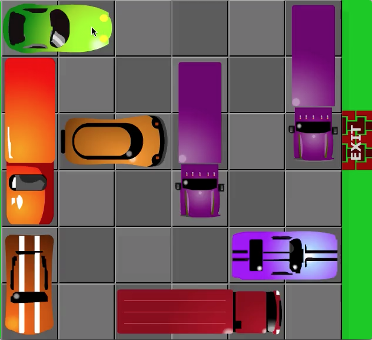

# Chapter 18 - Planning solves the Rush Hour problem

## Introduction

Rather than going through the algorithm first, it might be
better to look at the game first and see what functions are needed
to enable the game play.

[Rush Hour](http://www.amazon.com/Think-Fun-5000-ThinkFun-Rush/dp/B00000DMER) is a
sliding block puzzle played on a 6x6 grid.

Here's an example starting position from 
an [online version](http://www.agame.com/game/rush_hour_2):



The objective is to get the 2-block car on row 3 to the exit.

We define the following basic types to describe the 
game state:

```haskell
type Cell = Int
type Grid = [(Cell, Cell)] 
```

The cell is an integer value taken from the following grid:

```haskell
01 02 03 04 05 06
08 09 10 11 12 13
15 16 17 18 19 20
22 23 24 25 26 27
29 30 31 32 33 34
36 37 38 39 40 41
```

The grid itself is a list of tuples of starting and ending points
for a vehicle. The grid in the book can be described as:

```haskell
g1 :: Grid
g1 = [  (17, 18), -- Special vehicle - i.e. our car.
        (1, 15), 
        (2, 9), 
        (3, 10), 
        (4, 11), 
        (5, 6), 
        (12, 19), 
        (13, 27), 
        (24, 26), 
        (31, 38), 
        (33, 34), 
        (36, 37), 
        (40, 41)]
```

The one in the image above is:

```haskell
g2 :: Grid
g2 = [  (16, 17), -- Special vehicle - i.e. our car.
        (1, 2),
        (8, 22),
        (29, 36),
        (11, 25),
        (38, 40),
        (33, 34),
        (6, 20)]
```

## Displaying the Grid

While this Grid representation is more space-efficient than using regular 
cartesian coordinates, it does make it a bit tricker to display 
the grid. We want something like this:

```haskell
ghci> drawGrid g1
 a b c d e e
 a b c d f g
 a . @ @ f g 
 . . h h h g
 . . i . j j
 k k i . l l

ghci> drawGrid g2
 a a . . . g
 b . . d . g
 b @ @ d . g 
 b . . d . .
 c . . . f f
 c . e e e .
```

We can represent this as a string of 36 characters, with "." for an empty
cell, "@" for the special vehicle, and "a" to "z" for the other vehicles.

Our approach is to populate a grid map for each individual vehicle and
then superimpose all of them to produce a final grid map that can be
displayed.

Firstly, let's define the string representation of a completely blank grid:

```haskell
blankGrid :: String
blankGrid = replicate 36 '.'
```

This is just 36 dots representing 36 empty cells.

```haskell
ghci> blankGrid
"...................................."
```

Next we need to go from the positions in the grid to index positions 
within the string:

```haskell
cellToArrayPos :: Cell -> Int
cellToArrayPos c = (c `div` 7) * 6 + (c `mod` 7) - 1
```

For a horizontal vehicle, the mapping from the cells to array indices is simple:

```haskell
map cellToArrayPos  [a .. b]
```

For vertical vehicles, it's a bit more detailed:

```haskell
verticalPositions :: (Cell, Cell) -> [Int]
verticalPositions (a, b) 
    | b - a > 12    = [a, a + 7, b]
    | b - a == 7    = [a, b]
    | otherwise     = []
```

So we have the following function to convert from the cell positions

```haskell
vehiclePositions :: Grid -> [[Cell]]
vehiclePositions  = map vehiclePos
  where
    vehiclePos (a, b) 
        | isHorizontal (a, b)   = map cellToArrayPos  [a .. b]
        | otherwise             = map cellToArrayPos $ verticalPositions (a, b)
```

A vehicle is horizontal if the difference between the end cell and start cell
is less than 6. (Remember, the vehicles are either 2 or 3 cell lengths long). If
the difference is greater than 6, it's vertical:

```haskell
isHorizontal :: (Cell, Cell) -> Bool
isHorizontal (c1, c2) = c2 - c1 < 6 

isVertical :: (Cell, Cell) -> Bool
isVertical (c1, c2) = c2 - c1 > 6 
```

We can put the vehicle names in a list of characters:

```haskell
vehicleNames :: String
vehicleNames = "@" ++ ['a'..] -- The first vehicle is our special one - we mark it with an @.
```

Displaying a single vehicle in a map is as follows:

```haskell
showVehicle :: (Char, [Int]) -> String
showVehicle (c, xs) = gridPoints xs 0
  where
    gridPoints [] n   = replicate (36 - n) '.'
    gridPoints (x:xs) n = replicate (x - n) '.' ++ [c] ++ gridPoints xs (x + 1)
```

This gives us a string with a single vehicle represented on the grid. We can 
combine two of these to give us a superimposed view:

```haskell
superimpose :: String -> String -> String
superimpose = zipWith combine
  where
    combine :: Char -> Char -> Char
    combine topCh bottomCh
        | topCh == '.' && bottomCh == '.'   = '.'
        | topCh == '.' && bottomCh /= '.'   = bottomCh
        | topCh /= '.' && bottomCh == '.'   = topCh
        | topCh /= '.' && bottomCh /= '.'   = 'X'
```

Finally, we can show a grid to give us the final string representation for the
grid:

```haskell
showGrid :: Grid -> String
showGrid g = foldl superimpose blankGrid vehicleGrids
  where
    vehicles = zip vehicleNames (vehiclePositions g)
    vehicleGrids = map showVehicle vehicles
```

Displaying this string in a in a 6x6 grid is as follows:

```haskell
drawGrid :: Grid -> IO ()
drawGrid g = putStr $ intersperse ' ' $ "\n" ++ unlines (chunksOf 6 $ showGrid g)
```

Code in chap18a.hs


